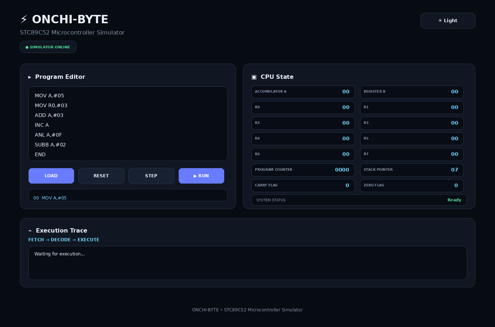
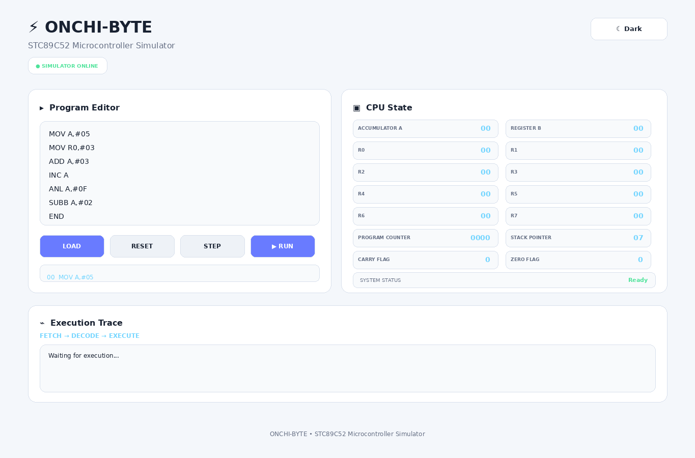
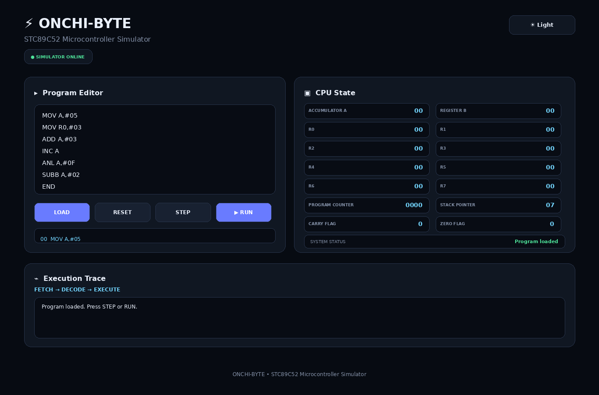
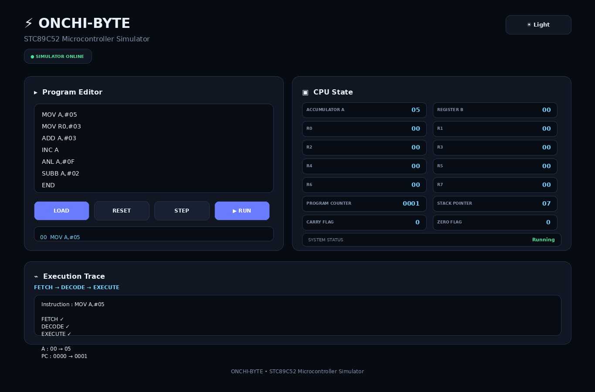
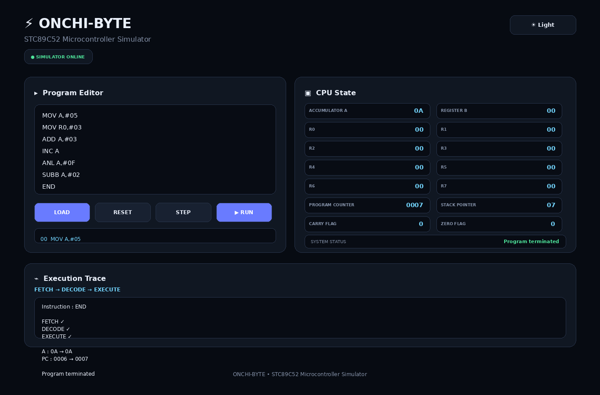
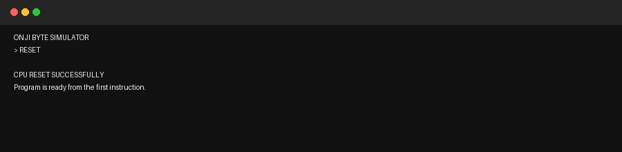

# STC89C52 Microcontroller Simulator – Week 2

## Overview

Week 2 focuses on the basic STC89C52 CPU simulation and a simple interactive simulator interface. The simulator allows a user to enter assembly instructions, load them, execute them step-by-step or run them continuously, reset the CPU state, and observe register/flag changes and the execution trace.

## Current UI

The current ONCHI-BYTE interface contains:

- **Program Editor** – enter or edit assembly instructions.
- **LOAD** – loads the program and resets the CPU state for execution.
- **RESET** – clears the execution state and returns the simulator to Ready.
- **STEP** – executes one instruction and shows FETCH → DECODE → EXECUTE details.
- **RUN** – executes the loaded program automatically.
- **CPU State** – displays A, B, R0–R7, PC, SP, Carry Flag and Zero Flag.
- **Execution Trace** – shows the current instruction and execution result.
- **Day / Light Mode** – switches between the dark and light interface themes.

## Supported Instructions

The Week 2 simulator currently demonstrates instructions including:

```text
MOV
ADD
SUBB
ANL
INC
CLR
SJMP
END
```

## Demo Program

```text
MOV A,#05
MOV R0,#03
ADD A,#03
INC A
ANL A,#0F
SUBB A,#02
END
```

## How to Run

The web UI can be opened directly from the testing repository. For the Java simulator in the main project:

```bash
git clone -b main https://github.com/Hisham-Muhammed/MicroOS-Sim.git
cd MicroOS-Sim/src
javac *.java
java Main
```

## UI States

### 1. Initial / Dark Mode


### 2. Light Mode


### 3. Program Loaded


### 4. Step Execution


### 5. Run Complete


### 6. Reset


