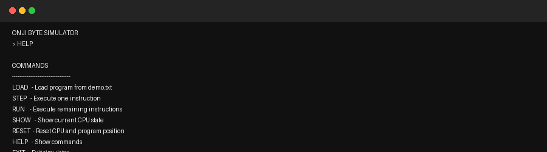
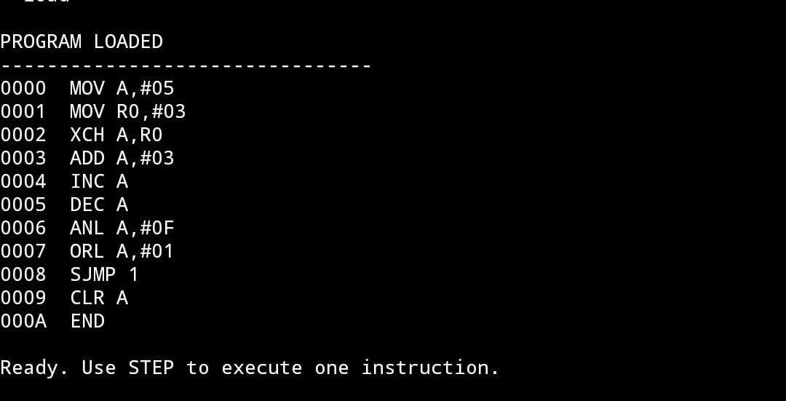
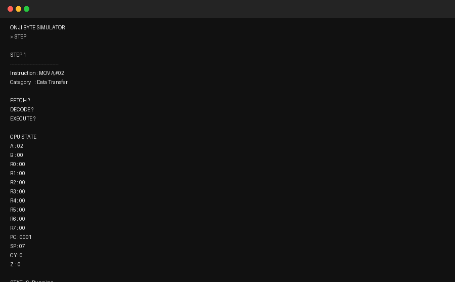
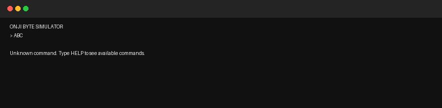

# STC89C52 Microcontroller Simulator – Week 2

## Run in VS Code

### 1. Clone the Week-2 branch

```bash
git clone -b week-2 https://github.com/Hisham-Muhammed/MicroOS-Sim.git
```

### 2. Open the project

```bash
cd MicroOS-Sim
```

Open the folder in VS Code.

### 3. Compile and run

```bash
cd src
javac *.java
java Main
```

## Run the Main Branch

```bash
git clone -b main https://github.com/Hisham-Muhammed/MicroOS-Sim.git
cd MicroOS-Sim/src
javac *.java
java Main
```

## Simulator Commands

```text
LOAD
STEP
RUN
SHOW
RESET
HELP
EXIT
```

- `LOAD` – Load the demo program.
- `STEP` – Execute one instruction at a time.
- `RUN` – Run the loaded program.
- `SHOW` – Display the current simulator state.
- `RESET` – Reset the simulator.
- `HELP` – Display available commands.
- `EXIT` – Exit the simulator.


## Simulator States

### HELP


### LOAD


### STEP


### RUN


### RESET


### Wrong Command


## Testing

From the `src` folder:

```bash
javac -cp . ../tests/InstructionTest.java
java -cp .:../tests InstructionTest

javac -cp . ../tests/DemoProgramTest.java
java -cp .:../tests DemoProgramTest
```

## Custom Programs

The demo program is stored in the `programs` folder.

You can edit the program file in this folder to change the instructions executed by the simulator.

After editing the program, run the simulator again and use:

```text
LOAD
RUN
```

The simulator will execute the updated program.
